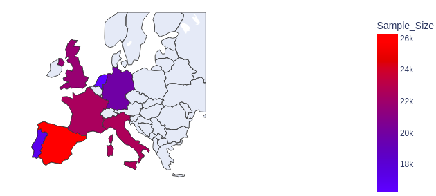
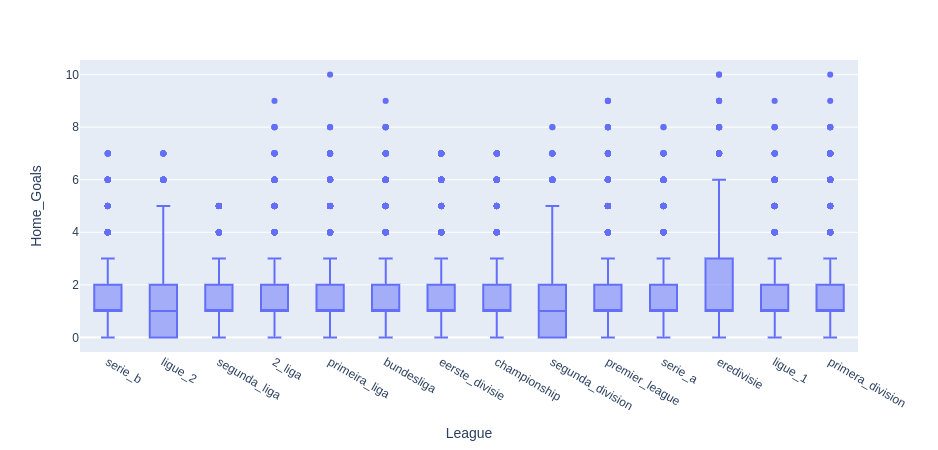

# Football Match Outcome Prediction

In this project, I'm implementing a data science pipeline seeking to predict the outcome of football matches. This uses:
- the pandas libary for data wrangling and cleaning, including Levenshtein Distance textual comparisons via FuzzyWuzzy
- exploratory data analysis and visualisation via plotly
- **to be updated as the project progress**

## Milestone 1 - EDA and Data Cleaning

- The Data Cleaning framework extracts different structured and unstructured sources of related data and validates, cleans, compares and merges it into one combined dataframe. The different data sources are csv and pickkle files containing results data, match details, ELO, and team data. These have been combined via common links on besoccer.com and team names. The end result is a dataset with ~140k entries and 18 features (noting that not all will be of use).

- Data cleaning has been carried out using standard python commands, pandas library, and fuzzywuzzy textual comparison. The notebook has been written to annotate the thought process and will later be built into a pipeline with minimal human interaction.

- Sample graphs have been plotted to better understand and visualise the data, in order to inform and determine my strategy going forward.





- It is expected that the following features will be of use going forward:
    - Result - this will need cleaning to be in a useful numerical format
    - ELO rating - this measures the relative strength of the teams at the point of the match
    - Round / Season - these are inherently linked to team ELO (e.g. if team gets stronger throughout the season, its ELO will also increase)
    - Date_New - depending on the reliability of this data, this could provide insight into correlations relating to matches played on days of the week and at different times
    - Red/Yellow cards - to be investigated as this won't be known before a match
    - Capacity - strength of crowd (noting that attendence isn't known)


- Null Hypothesis: **H<sub>0</sub>: The outcome of football natches cannot be predicted by previous statistics/records alone.**


#### *** WIP - TO BE UPDATED BEYOND THIS POINT ***


- Answer some of these questions in the next few bullet points. What have you built? What technologies have you used? Why have you used those?

- Example: The FastAPI framework allows for fast and easy construction of APIs and is combined with pydantic, which is used to assert the data types of all incoming data to allow for easier processing later on. The server is ran locally using uvicorn, a library for ASGI server implementation.
  
```python
"""Insert your code here"""
```

> Insert an image/screenshot of what you have built so far here.

## Milestone 2

- Does what you have built in this milestone connect to the previous one? If so explain how. What technologies are used? Why have you used them? Have you run any commands in the terminal? If so insert them using backticks (To get syntax highlighting for code snippets add the language after the first backticks).

- Example below:

```bash
/bin/kafka-topics.sh --list --zookeeper 127.0.0.1:2181
```

- The above command is used to check whether the topic has been created successfully, once confirmed the API script is edited to send data to the created kafka topic. The docker container has an attached volume which allows editing of files to persist on the container. The result of this is below:

```python
"""Insert your code here"""
```

> Insert screenshot of what you have built working.

## Milestone n

- Continue this process for every milestone, making sure to display clear understanding of each task and the concepts behind them as well as understanding of the technologies used.

- Also don't forget to include code snippets and screenshots of the system you are building, it gives proof as well as it being an easy way to evidence your experience!

## Conclusions

- Maybe write a conclusion to the project, what you understood about it and also how you would improve it or take it further.

- Read through your documentation, do you understand everything you've written? Is everything clear and cohesive?
